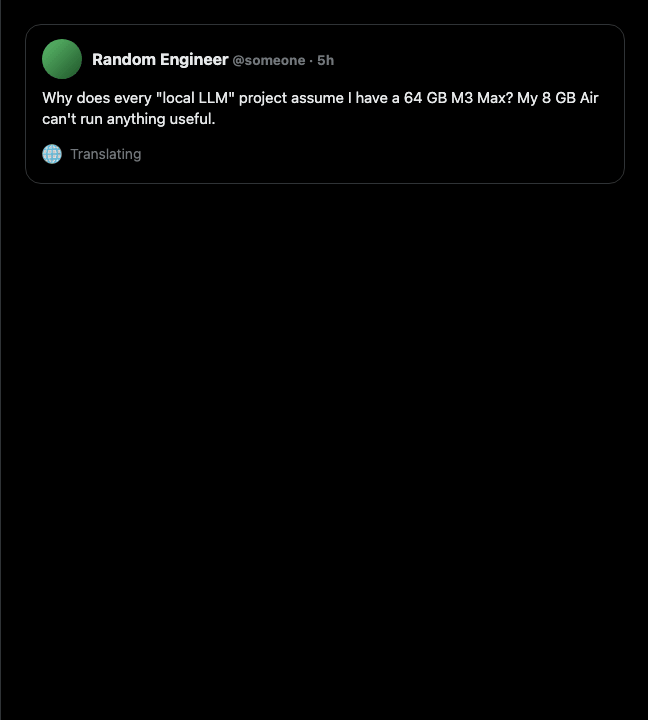

# TweAI — AI Reply Assistant for X (Twitter)

> Open-source Chrome extension that drafts AI replies on X / Twitter in your own voice, with personas, multilingual support, and your own OpenAI key. **No subscription. No backend. Your key, your data.**

[](LICENSE)
[](https://developer.chrome.com/docs/extensions/mv3/intro/)
[](#privacy)



---

## Why I built this

2025. I was in Bangkok, my Thai was bad, and X's auto-translate would either
break the page or render slang as nonsense. I wanted to read the timeline and
reply like a human, not like Google Translate having a stroke. So TweAI started
as a personal translator with persona-aware replies — long before X shipped
the neural one.

Personas, flirt mode, deep author context, the careful work on prompt-injection
defence — all of that is here because the original use case was actual human
conversation across a language gap, not "scaling thought leadership." The
extension was always for one person; it's just open-source now in case you have
the same problem.

---

## Features

- ✍️ **AI Reply with personas** — 5 built-in tech-creator personas (Founder, Engineer, Researcher, Casual, Flirt) plus your own custom personas with arbitrary system prompts.
- 🪪 **Per-account memory** — different default persona depending on which X account is active in the tab.
- 🤖 **Explain any tweet** — 2–3 bullet summary: gist, tone, context.
- 🌐 **Auto-translate the timeline** — lazy via IntersectionObserver, cached locally so you never re-translate the same tweet.
- 🎯 **Deep context** — optionally include the author's last 5 tweets so the reply matches their thread.
- 💬 **DM composer** — same prompt + Tweet flow for direct messages.
- 💸 **Token budget** — daily soft-limit on input + output tokens; blocks API calls when exceeded.
- 🩺 **Diagnostics** — one-click health check verifies key, provider connectivity, and that X DOM selectors still match.
- 🔑 **BYOK** — your OpenAI (or Google Translate) key, stored locally. Nothing transits a server we control.
- 🌍 **Multilingual** — UI labels in English/Russian; replies in any of 12 languages or matching the source tweet.

## Install

### From source (recommended while in beta)

```bash
git clone https://github.com/froggychips/tweai.git
```

1. Open `chrome://extensions`
2. Enable **Developer mode** (top-right)
3. Click **Load unpacked** and select the `TweAI` directory

### From the Chrome Web Store

_Coming soon. The extension is currently in beta — install from source above._

## Configure

1. After loading the extension, click its icon → **Options**.
2. Paste your **OpenAI API key** (`sk-...`). [Get one at platform.openai.com](https://platform.openai.com/api-keys).
3. Optionally:
   - Set a **default persona** (Tech Founder, Engineer, AI Researcher, Casual Tech, Flirt).
   - Pick a **default reply language** (or `auto` to match your browser).
   - Switch translation **provider** to Google Translate API if you have a key (cheaper for high-volume timeline translation).
4. Click **Test API Key** to verify, then **Save**.

## Usage

| Trigger | What it does |
|---|---|
| Open `x.com` or `twitter.com` | Auto-translates each tweet as it scrolls into view (toggleable in options) |
| Click **🤖 Explain** under any tweet | Renders a 2–3 bullet AI analysis |
| Click **AI Reply** with style + persona | Generates a draft reply matching the chosen voice |
| Toggle **Deep** before AI Reply | Includes the author's recent tweets as context |
| Click **✍️**, type a prompt, press Enter | Sends a custom prompt to the AI for a tailored draft |
| Click **Tweet** | Translates the draft into the source tweet's language, opens the native reply box, inserts the text |

## Permissions, in plain words

| Permission | What it's actually for |
|---|---|
| `storage` | Save your API key, preferences, custom personas, per-account rules. |
| `scripting`, `activeTab` | Inject the in-page UI (buttons, submenu, composer). |
| `webNavigation` | Detect SPA navigation on x.com so the UI survives client-side routing. |
| `clipboardWrite` | The Tweet button's clipboard fallback when the native composer isn't available. |
| `host_permissions` | `api.openai.com`, `x.com`, `twitter.com`. |

## Privacy

TweAI is **bring-your-own-key**. There is no backend. Your API key, your prompts, and the AI responses never pass through any server we control. See [`PRIVACY.md`](PRIVACY.md) for the full breakdown.

## Security

The extension wraps tweet text in delimiters and explicitly instructs the model to treat it as data, not instructions, defending against the most common prompt-injection attacks. To report a vulnerability, open a [private security advisory](https://github.com/froggychips/tweai/security/advisories/new). See [`SECURITY.md`](SECURITY.md).

## Roadmap

- [x] Personas (Tech creator preset)
- [x] BYOK + privacy-first
- [x] Prompt-injection hardening
- [x] Custom persona editor (write your own system prompt)
- [x] Per-account persona memory (different voice on different X accounts)
- [x] Token-budget and daily limits in Options
- [x] Health-check (verify selectors and provider connectivity)
- [ ] Chrome Web Store publication
- [ ] Cloud-tier (24/7 monitoring, lead-gen pipeline) — for B2B; explicitly opt-in

## Releasing

```bash
npm install
npm run lint
npm run format
npm run package          # → dist/ + tweai-v<version>.zip
```

`tools/build.mjs` builds the CWS-ready zip with the right inclusions (no `tweai-mcp-server/`, no `docs/`). The same script runs in [`.github/workflows/release.yml`](.github/workflows/release.yml) — pushing a `v*` tag uploads a GitHub release with the zip attached automatically.

CWS submission checklist: [`docs/CWS_REVIEW.md`](docs/CWS_REVIEW.md). Launch-day copy: [`docs/LAUNCH.md`](docs/LAUNCH.md). Demo GIF: [`docs/RECORDING.md`](docs/RECORDING.md).

## Contributing

See [CONTRIBUTING.md](CONTRIBUTING.md) for project layout, local dev, and PR conventions. Architecture overview lives in [docs/ARCHITECTURE.md](docs/ARCHITECTURE.md). If something on x.com stops working, start with [docs/TROUBLESHOOTING.md](docs/TROUBLESHOOTING.md).

The project has zero runtime dependencies. Source is plain MV3 JavaScript; only `eslint` and `prettier` ship as dev-deps.

## Contact

- GitHub Issues: https://github.com/froggychips/tweai/issues
- Telegram: [@froggychips](https://t.me/froggychips)

## License

Apache 2.0 — see [`LICENSE`](LICENSE).
